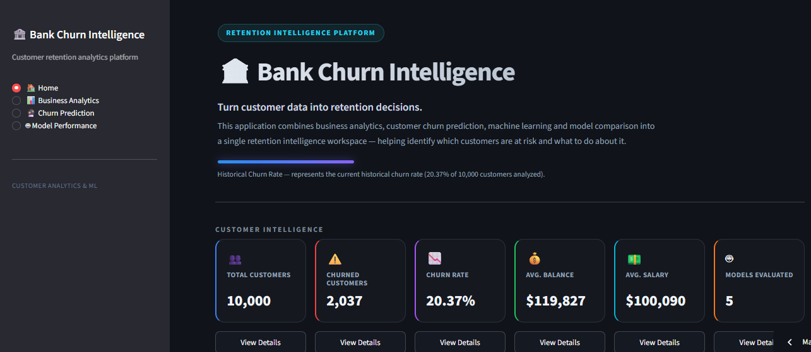
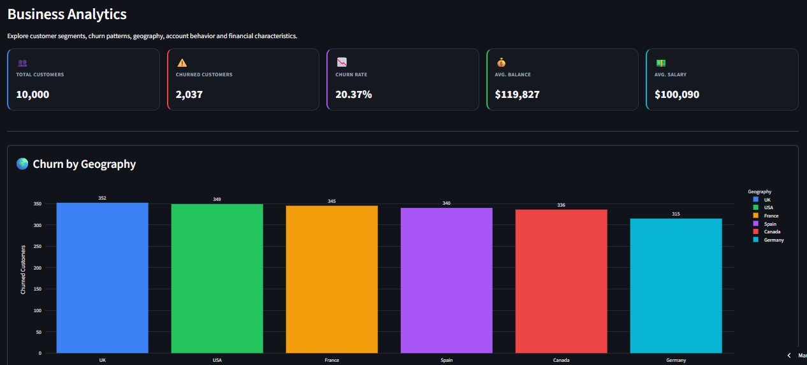
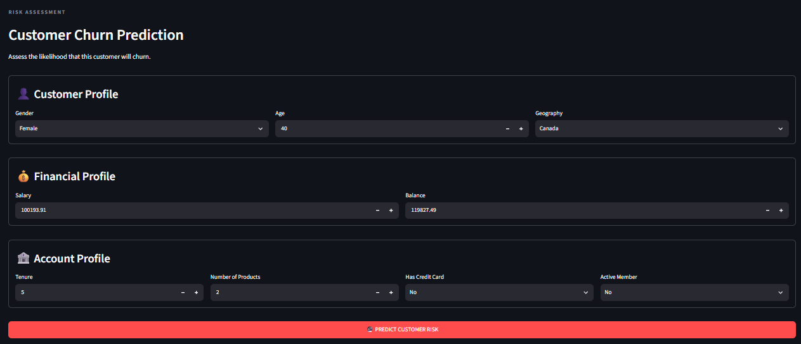
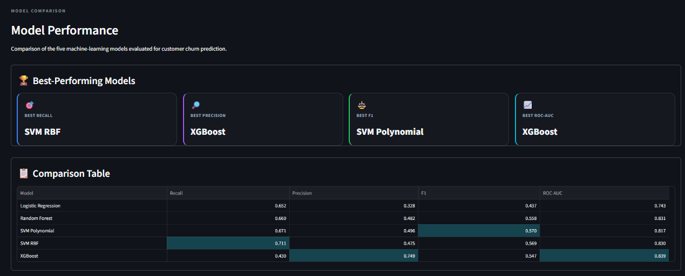

# 🏦 End-to-End Banking Customer Churn Analytics & Predictive Modeling

<p align="left">

</p>

<p align="left">

<a href="https://www.python.org/">

</a>

<a href="https://streamlit.io/">

</a>

<a href="https://pandas.pydata.org/">

</a>

<a href="https://plotly.com/python/">

</a>

<a href="https://scikit-learn.org/">

</a>

<a href="https://xgboost.readthedocs.io/">

</a>

<a href="https://www.microsoft.com/en-us/sql-server">

</a>

</p>

---

# 1. 📌 Overview 

Customer churn is a significant challenge in the banking industry because losing existing customers can negatively affect revenue, customer lifetime value, and long-term relationships.

This project develops an **end-to-end banking customer churn analytics and predictive modeling solution** that combines SQL, Python, statistical analysis, machine learning, and Streamlit into a single analytical workflow.

The platform helps answer:

- Which customer segments show higher churn?
- What patterns are associated with customer attrition?
- How well can different machine-learning models predict churn?
- What is the estimated churn risk for an individual customer?

---

# 2. 🚀 Dashboard Demo


##  Live Dashboard

<p align="center">

<a href="https://end-to-end-banking-customer-churn-analytics-predictive-modeling.streamlit.app/">

</a>

</p>
### 🏠 Home



### 📊 Business Analytics



### 🔮 Customer Churn Prediction



### 🤖 Model Performance



---

# 3. ⭐ Key Features

### 📊 Business Analytics

- Customer-level KPI analysis
- Overall churn-rate calculation
- Churn analysis by geography
- Churn analysis by age
- Churn analysis by number of products
- Churn analysis by active-member status
- Interactive Plotly visualizations
- Business-oriented analytical insights

### 🔮 Customer Churn Prediction

- Individual customer risk assessment
- Customer demographic inputs
- Financial profile inputs
- Account profile inputs
- Feature engineering during prediction
- Saved preprocessing pipeline
- Saved machine-learning model
- Churn probability estimation
- High / Low churn-risk classification
- Retention-oriented recommendation

### 🤖 Model Comparison

Five machine-learning models were evaluated:

- Logistic Regression
- Random Forest
- SVM Polynomial
- SVM RBF
- XGBoost

Models are compared using:

- Recall
- Precision
- F1-score
- ROC-AUC

### 🧪 Statistical Analysis

- Statistical hypothesis testing
- Investigation of relationships between customer characteristics and churn
- Supporting analytical evidence for feature investigation

### 🗄️ SQL Analytics

- Relational data modeling
- SQL Server integration
- Churn-rate analysis
- Gender-based churn analysis
- Average churn-related analysis
- Dynamic SQL parameter analysis

---

# 4. 🛠️ Tech Stack

## Languages

- **Python**
- **SQL**

## Data Analysis

- **Pandas**
- **NumPy**

## Statistical Analysis

- **SciPy**
- Statistical hypothesis testing

## Machine Learning

- **Scikit-learn**
- **XGBoost**

## Visualization

- **Plotly**
- Streamlit charts

## Database

- **Microsoft SQL Server**
- **PyODBC**
- **SQLAlchemy**

## Application & Deployment

- **Streamlit**
- **Joblib**
- **Git**
- **GitHub**

## Development

- Jupyter Notebook
- VS Code
- Python Virtual Environment

---

# 5. 📂 Project Structure

```text
End-to-End-Banking-Customer-Churn-Analytics-Predictive-Modeling/
│
├── dashboard/
│   ├── business_analytics.png
│   ├── churn_prediction.png
│   ├── home.png
│   └── model_performance.png
├── data/
│   ├── processed/
│   │   ├── account.csv
│   │   ├── demographic.csv
│   │   └── location.csv
│   │
│   └── raw/
│       └── raw_data.xlsx
│
├── eda_queries/
│   ├── ChurnRate Accross Genders.sql
│   ├── Difference Average ChrunRate.sql
│   └── Dynamic Parameters.sql
│
├── models/
│   └── churn_model_bundle.pkl
│
├── notebook/
│   ├── statistical_testing/
│   │   └── statistical_testing.ipynb
│   └── test.sql
│
├── predictive_modelling/
│   │
│   ├── experiments/
│   │   ├── __init__.py
│   │   ├── exp_LogisticReg.ipynb
│   │   ├── exp_RandomForest.ipynb
│   │   ├── exp_SVM_POL.ipynb
│   │   ├── exp_SVM_RBF.ipynb
│   │   ├── exp_XGBoost.ipynb
│   │   └── model_comparison.ipynb
│   │
│   ├── processed_data/
│   │   ├── dataset_bundle.pkl
│   │   └── preprocessing_bundle.pkl
│   │
│   ├── evaluation_script.py
│   └── preprocessing.py
│
├── scripts/
│   ├── data cleaning/
│   │   ├── account.py
│   │   ├── demographic.py
│   │   ├── functions.py
│   │   └── location.py
│   │
│   ├── data_ingestion/
│   │   ├── create_tables.sql
│   │   └── sql_connection.py
│   │
│   └── utils/
│       ├── enviroment.ps1
│       └── project_structure.py
│
├── screenshots/
│   ├── home.png
│   ├── business_analytics.png
│   ├── churn_prediction.png
│   └── model_performance.png
│
├── app.py
├── README.md
├── requirements.txt
└── .gitignore

```
## 7. 📈 Results & Key Findings

### Dataset Overview

The dashboard currently analyzes:

| Metric | Result |
|---|---:|
| Total Customers | 10,000 |
| Churned Customers | 2,037 |
| Historical Churn Rate | 20.37% |
| Average Balance | ~$119,827 |
| Average Salary | ~$100,090 |
| Models Evaluated | 5 |

---

### 🤖 Model Performance
Five machine-learning models were evaluated using Recall, Precision, F1-score, and ROC-AUC.

| Model | Recall | Precision | F1-score | ROC-AUC |
|---|---:|---:|---:|---:|
| Logistic Regression | 0.652 | 0.328 | 0.437 | 0.743 |
| Random Forest | 0.660 | 0.482 | 0.558 | 0.831 |
| SVM Polynomial | 0.671 | 0.496 | **0.570** | 0.817 |
| SVM RBF | **0.711** | 0.475 | 0.569 | 0.830 |
| XGBoost | 0.430 | **0.749** | 0.547 | **0.839** |

### 🏆 Best-Performing Models by Metric

| Metric | Best Model | Score |
|---|---|---:|
| 🎯 Recall | SVM RBF | 0.711 |
| 🔎 Precision | XGBoost | 0.749 |
| ⚖️ F1-score | SVM Polynomial | 0.570 |
| 📈 ROC-AUC | XGBoost | 0.839 |
- Model selection therefore depends on the business objective and the relative cost of false positives and false negatives.
  

### 📊 Key Business Findings

The analysis identified several notable patterns in customer churn:

- The dataset contains **10,000 customers**, with a historical churn rate of **20.37%**.
- Churn varies across **geographic markets**, with the UK recording the highest number of churned customers in the dataset.
- **Inactive customers** show a substantially higher observed churn rate than active customers.
- Churn rates vary considerably across **customer age groups**.
- Customers with **three or four products** show substantially higher observed churn rates than customers with one or two products.

---

### 💼 Business Interpretation

The analysis can support a retention workflow by helping identify customer segments with higher observed churn and by providing individual-level churn predictions.

The dashboard combines historical analysis with predictive modeling so that users can move from:

**Analyze → Predict → Prioritize → Act**

---


## 8. 🔮 Future Scope

The current project provides an end-to-end foundation for banking customer churn analysis and prediction. Future improvements could include:

### 🎯 Advanced Churn Modeling

- Hyperparameter optimization
- Cross-validation
- Improved class-imbalance handling
- Business-driven probability threshold optimization
- Probability calibration
- Explainable AI using SHAP
- Model interpretability analysis

### 📊 Advanced Analytics

- Customer segmentation
- Cohort analysis
- Customer lifetime value estimation
- Retention campaign analysis
- Churn trend monitoring
- Customer risk distribution analysis

### 🤖 Prediction Improvements

- Automated risk thresholds
- Low / Medium / High risk segmentation
- Batch prediction for multiple customers
- Customer-level risk ranking
- Prediction explanation and contributing factors
- Retention recommendation personalization

### 📈 Dashboard Improvements

- More interactive filters
- Customer segmentation controls
- Risk distribution visualizations
- Model explainability dashboard
- Retention campaign simulation
- Interactive customer-level analytics

---

## 🧠 End-to-End Workflow

```text
Data Ingestion
      ↓
Data Cleaning
      ↓
SQL Analysis
      ↓
Statistical Testing
      ↓
Feature Engineering
      ↓
Machine Learning
      ↓
Model Evaluation
      ↓
Model Serialization
      ↓
Streamlit Dashboard
      ↓
Customer Risk Prediction
      ↓
Retention Decision Support
```
## 📌 Project Takeaway

This project demonstrates an end-to-end workflow for transforming banking customer data into actionable churn intelligence.

It combines:

**SQL → Python → Statistics → Machine Learning → Model Evaluation → Streamlit**

The final application brings together **business-level churn analysis**, **machine-learning model comparison**, and **individual customer churn prediction** within a single interactive dashboard.

The overall workflow demonstrates how historical customer behavior can be analyzed, modeled, and translated into retention-oriented decision support.

---

## 👤 Author

**Nasrin Khatoon**

Data Analytics | Python | SQL | Machine Learning | Business Intelligence
